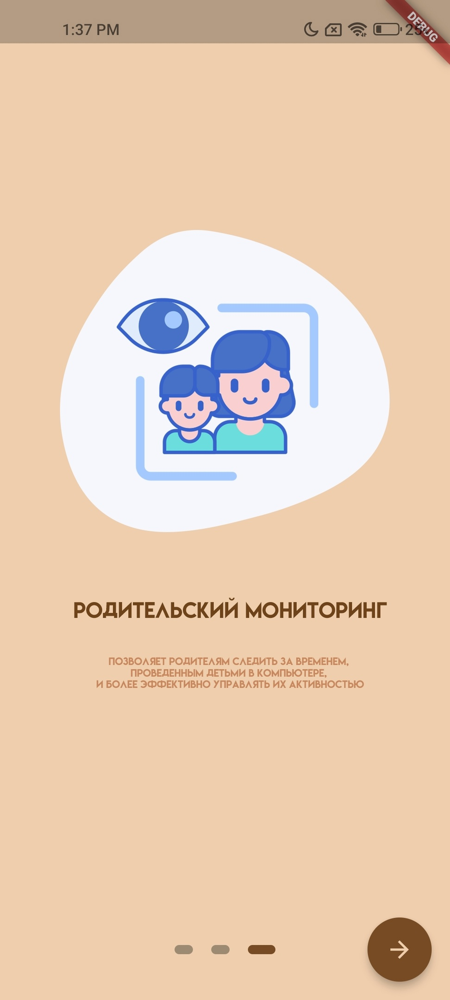
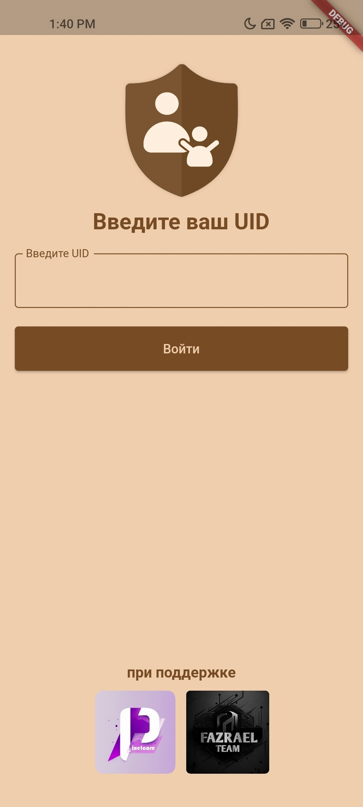
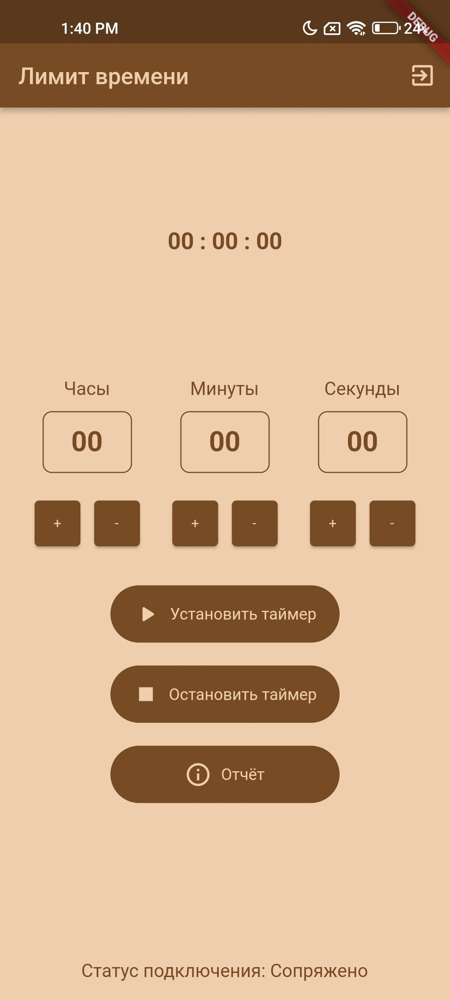
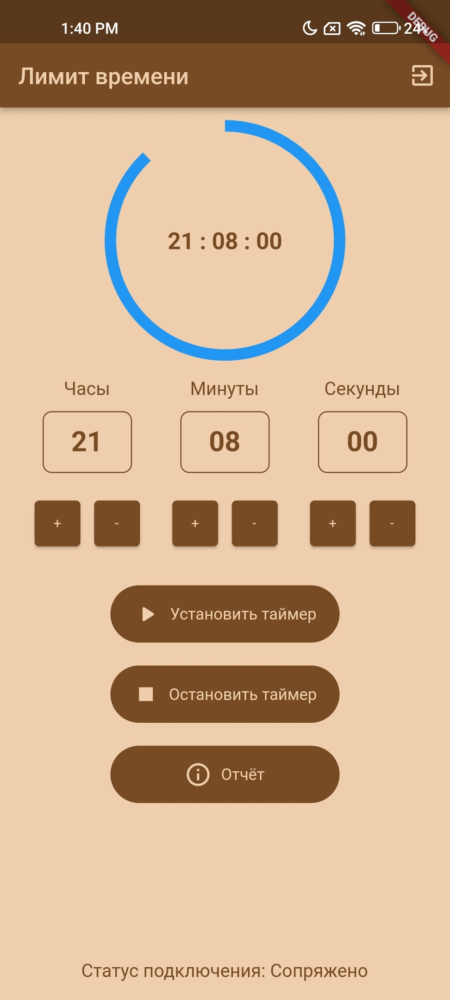
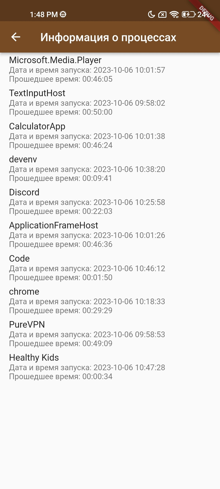

# ‍👩‍👧‍👦 Родительский контроль (версия для мобильного устройства)

**Название приложения**

Healthy Kids

**Описание**

**Healthy Kids** — это удобное и надежное приложение, разработанное с использованием технологии Flutter и WPF, которое предоставляет родителям полный контроль над детским компьютером. Данное приложение работает в паре с мобильным устройством и персональным компьютером, и обеспечивает удобный интерфейс для мониторинга и управления активностью ребенка. С удобным интерфейсом и надежной связью с персональным компьютером, это приложение становится незаменимым помощником для семей, стремящихся обеспечить здоровое и безопасное использование технологий своими детьми.

**Основные функции**

•	Сплеш-скрин - при запуске приложения на мобильном устройстве отображается стильный сплеш-скрин с логотипом приложения, который создает первое впечатление для пользователей.

•	Авторизация через UID - пользователь должен авторизоваться в приложении, используя уникальный идентификатор (UID), который связывает его мобильное устройство с компьютером, установленным на детском ПК. Это обеспечивает безопасную и надежную связь между устройствами.

•	Управление активностью - после успешной авторизации пользователь получает доступ к различным функциям управления действиями ребенка на компьютере. Пользователь может установить ограничение по времени, в течение которого ребенок может использовать компьютер. Это позволяет родителям устанавливать ограничения на время, проведенное перед экраном. Если родитель решит прервать компьютерное время ребенка, он может остановить таймер с помощью мобильного устройства. Это дает родителям контроль над активностью ребенка.

•	Получение отчета - приложение предоставляет возможность получать отчеты о том, какое время ребенок провел на компьютере. Отчет приходит ежедневно в виде удобного уведомления. Эти отчеты могут включать в себя информацию о времени начала и окончания активности, использованных приложениях.

•	Дружественный интерфейс - интерфейс приложения разработан с учетом удобства использования и интуитивной навигации, чтобы родителям было легко настраивать и управлять родительским контролем.

## 📸 Скриншоты

| 1 | 2|
|------|-------|
|||

| 3 | 4|
|------|-------|
|||

| 5 | 6|
|------|-------|
|||

| 7 |
|------|
||

## ⚒️ Технические требования
* Android - 7.0+
* ОЗУ - 1 Гб
* Процессор - 1.5 Ггц
* Доступ к интернету
* Свободное место в хранилище - 300 мб
* Разрешить отправление уведомления

## 💫 Средства разработки
- Visual Studio Code
- Flutter и Dart
- Photoshop
